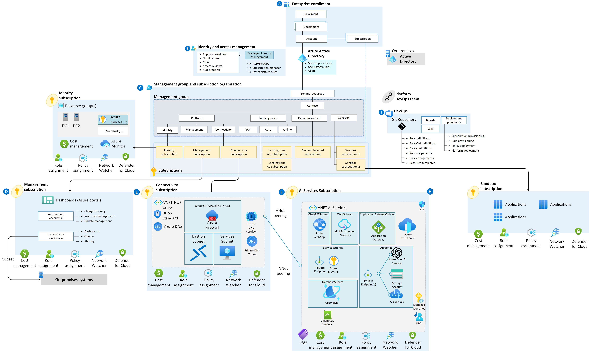

# Azure AI Landing Zone with Terraform



This GitHub repository provides a comprehensive guide and Terraform configurations to deploy an Azure AI Landing Zone—a specialized environment for empowering AI technologies, including advanced language models like GPT-4. The landing zone is designed to complement existing data management and data landing zones within your cloud-scale data analytics platform, enabling you to unlock the true potential of AI.
# Versions

* 1.2 - Major Improvements, added resources and automation for all the different landing zone resources and AI workload, added a basic scenario.
* 1.0 - Initial Landign Zone Deployments

## Architecture Scenarios

### Scenario: Secure Communication to Azure App Service via Private Link

In this scenario, the user deploys a standard landing zone architecture to ensure a well-organized and secure Azure environment. The architecture includes the following components and steps:

* Standard Landing Zone: The deployment begins with setting up a standard Azure Landing Zone. This Landing Zone follows best practices and guidelines for organizing resources and aligning with security and compliance standards.

* Internal Network Access: Users can access an Azure App Service from within the internal network. To achieve this, a jumpbox or bastion host is used as an entry point to the Azure network. Users connect to the jumpbox securely, and from there, they can access other resources within the Azure network.

* Azure App Service with Private Link: The Azure App Service is configured to use a private link. This private link ensures that the web application is only accessible over a private network, enhancing security and minimizing exposure to the public internet.

* Azure OpenAI Integration: The web application deployed in the Azure App Service needs to connect to Azure OpenAI. To achieve secure communication, it uses a private endpoint for Azure OpenAI. Private endpoints allow services to be accessed privately within a virtual network, reducing exposure to the public internet.

* Firewall Rules for Azure OpenAI: Since the Azure App Service's outbound IP address is dynamic and public, it requires additional configuration on the Azure OpenAI side. Firewall rules are set up in Azure OpenAI to allow communication from the Azure App Service's dynamic IP address. This ensures that the web application can establish a secure connection with Azure OpenAI while maintaining a private and secure network architecture.

* Overall, this architecture scenario emphasizes security and isolation by utilizing private endpoints, restricting access to internal networks, and carefully managing communication between the Azure App Service and Azure OpenAI. It allows users to securely access the web application within the Azure network while ensuring that external connections are controlled and protected.

### Scenario: Securely Exposing the Application with Application Gateway and WAF

In this scenario, you build upon the architecture from the first scenario to securely expose your application to external users. The key components and steps are as follows:

* Standard Landing Zone: As in the previous scenario, you start with a standard Azure Landing Zone to ensure a well-organized and secure Azure environment.

* Internal Network Access via Jumpbox: Users can still access the Azure App Service from within the internal network through a jumpbox or bastion host, ensuring secure access to internal resources.

* Azure App Service with Private Link: Your Azure App Service continues to use a private link, maintaining a high level of security by allowing access only over a private network.

* Azure OpenAI Integration with Private Endpoint: The web application within the Azure App Service connects to Azure OpenAI via a private endpoint, ensuring secure and private communication.

* Application Gateway: In this scenario, you introduce an Azure Application Gateway. The Application Gateway acts as a reverse proxy, providing load balancing and traffic routing capabilities.

* Web Application Firewall (WAF): The Application Gateway is configured with a Web Application Firewall (WAF). The WAF provides security features such as protection against common web application attacks, like SQL injection and cross-site scripting (XSS) attacks. It helps safeguard your application against web-based threats.

* Securely Exposing the Application: The Application Gateway and WAF allow you to securely expose your web application to external users. Traffic from external users passes through the Application Gateway, which then routes it to the Azure App Service.

* Firewall Rules for Azure OpenAI: Similar to the first scenario, you maintain firewall rules in Azure OpenAI to allow communication from the dynamic IP address of the Azure App Service, ensuring secure access to Azure OpenAI resources.

This architecture enhances the security of your web application by adding a layer of protection through the Web Application Firewall (WAF) while still leveraging the benefits of private endpoints for Azure OpenAI. It provides a secure and controlled way to expose your application to external users while protecting it from common web-based threats.

## Features

## Enterprise Landing Zone
### Hub and Azure Firewall Deployment
- Automated deployment of a Hub network and Azure Firewall using the Azure Terraform landing zone standard module.
- Enhances security and network architecture within the landing zone.

### Sample Configuration with Azure Firewall
- Provides users with readily available sample configurations for setting up the hub network, including Azure Firewall settings.
- Simplifies the initial configuration process.

### Example Firewall Policies
- Features a set of example firewall policies for securing and managing traffic within the landing zone.
- Predefined security policies are available for improved network protection.

### Workbook for Firewall Traffic Monitoring
- Deploys workbooks inside the Azure Firewall to have comprehensive monitoring and analysis of all traffic secured by the firewall.

### Private DNS Zones Automation
- Automates the deployment of private DNS zones, facilitating domain name resolution within the landing zone.
- DNS Resolver deployed and integrated with Private DNS Zones for centralized DNS resolved from and to on prem and in azure as well.
- 
### DNS Policy Example
- Demonstrates a policy example that automatically adds DNS entries to the private DNS zone for private endpoints in the hub.
- Simplifies Private DNS management and configuration.

### Core Resource and Management Groups Alignment with CAF
- Aligns the deployment with the Cloud Adoption Framework (CAF) guidelines.
- Establishes a structured and organized resource hierarchy.

### Custom Azure Policies
- Configures custom Azure policies to allow specific resource creation, such as audit VNets without Network Security Groups (NSGs).
- Maintains security and compliance while providing flexibility.

### Monitoring and Logs Resources Deployment
- Automates the deployment of resources necessary for monitoring and logging within the landing zone, Azure Monitor, Log Analytics, diagnostic settings, etc.
- Enhances visibility and compliance tracking.

### Independent Module Deployment
- Enables users to deploy each module independently using orchestration tools or scripts.
- Promotes modularity and flexibility in configuration.

### Azure Bastion and Jumpbox
- Deploys Azure Bastion and Jumpbox solutions for secure access to private resources within the landing zone.
- Enhances remote access and security for administrators.

## AI Landing Zone - Features

### Sample Private GPT Web Application
- A sample web application that connects to OpenAI and utilizes CosmosDB for storing conversation history.
- Provides the ability to connect to Cognitive Search for using custom indexed data.

### Linux Web App Deployment
- Deploys the web application inside a Linux web app using Azure App Service.
- Ensures a scalable and reliable hosting environment.

### Private Link for OpenAI Service
- Establishes a Private Link for the OpenAI service.
- Implements firewalling rules to allow secure communication between the web app and OpenAI.
  
### Application Gateway and WAF Deployment
- Deploys an Application Gateway with Web Application Firewall (WAF) to securely expose your chat web app to the internet.
- Enhances security and protection against common web application attacks.

### Azure API Management (APIM) Integration (Work in Progress)
- Integration with Azure API Management (APIM) is in progress, allowing for comprehensive API management and monitoring.

### Routing and VNET Integration
- Establishes routing and integrates with Virtual Network (VNET) for secure communication and isolation.
- Utilizes Network Security Groups (NSGs) to control traffic and enhance network security.

### Integration with Main Landing Zone
- Integrates seamlessly with the main landing zone using network peering.
- Provides a consistent and cohesive infrastructure for AI workloads within the broader Azure environment.


## Getting Started

To deploy the Azure AI Landing Zone with Terraform, follow the steps below:

### 1. Set up Connectivity

*   Create a file `/Landing_Zones/terraform.tfvars`.
*   Replace `<your connectivity subscription>` with your actual connectivity subscription ID in the `connectivity_subscription` field.
*   Modify settings in the file `/Landing_Zone/settings.connectivity.tf` based on your requirements.
*   Authenticate to Azure using `az login`.

  Example terraform.tfvars

  ```
connectivity_subscription = "adfc81b4-9732-4b10-88ad-07cf9a644863"
management_subscription   = "afe15bcc-5275-4922-8181-217ee69e0e9b"
identity_subscription     = "acbe85ef-65aa-4539-a13c-4476f32f9610"
ai_lz_subscription        = "abc37ac5-188c-42aa-9b19-f5a7a62236a6"
location                  = "eastus"
email_security_contact    = "freddyayala@toto.com"
log_retention_in_days     = 30
management_resources_tags = {}
scope_management_group    = "contoso corp"
spoke_peerigns =["/subscriptions/abc37ac5-188c-42aa-9b19-f5a7a62236a6/resourceGroups/rg-network/providers/Microsoft.Network/virtualNetworks/vnet-ai-lz"]
  ```

### 2. Initialize and Preview the Deployment

*   Open your command line interface application and navigate to the `/Landing_Zone` folder.
*   Run `terraform init -reconfigure` to initialize the Terraform repository using local state.
*   Preview the deployment by running `terraform plan -var-file="terraform.tfvars"`.

### 3. Deploy the Connectivity Infrastructure

*   Execute `terraform apply -var-file="terraform.tfvars"` to deploy the connectivity infrastructure for the landing zone.


### 4. Deploy AI Workloads

*   Navigate to the `/Workload/AI` folder.
*   Create a file `/Workload/AI/terraform.tfvars`.
*   Replace `<your connectivity subscription>` and `<your AI subscription>` with your respective subscription IDs.
*   Copy the ID of your hub VNet deployed during the landing zone and paste it in the `hub_vnet_id` field.
*   Follow the same steps as above to deploy the AI workloads.

  Example terraform.tfvars:
```
  connectivity_subscription = "adfc81b4-9732-4b10-88ad-07cf9a644863"
  ai_subscription           = "abc37ac5-188c-42aa-9b19-f5a7a62236a6"
  hub_vnet_id = "/subscriptions/adfc81b4-9732-4b10-88ad-07cf9a644863/resourceGroups/es-connectivity-eastus/providers/Microsoft.Network/virtualNetworks/es-hub-eastus"
  hub_dns_servers =["10.100.1.132","168.63.129.16"]
  open_ai_private_dns_zone_id="/subscriptions/adfc81b4-9732-4b10-88ad-07cf9a644863/resourceGroups/es-dns/providers/Microsoft.Network/privateDnsZones/privatelink.openai.azure.com"
  app_service_private_dns_zone_id="/subscriptions/adfc81b4-9732-4b10-88ad-07cf9a644863/resourceGroups/es-dns/providers/Microsoft.Network/privateDnsZones/privatelink.azurewebsites.net"
```

### 5. Configure APIM

*   Use the provided policy in the README to test OpenAI API behind APIM.
*   Replace `<Your OpenAI API Key>` and `<Your OpenAI Backend Service>` with your actual API key and backend service URL.
<!--
    IMPORTANT:
    - Policy elements can appear only within the <inbound>, <outbound>, <backend> section elements.
    - To apply a policy to the incoming request (before it is forwarded to the backend service), place a corresponding policy element within the <inbound> section element.
    - To apply a policy to the outgoing response (before it is sent back to the caller), place a corresponding policy element within the <outbound> section element.
    - To add a policy, place the cursor at the desired insertion point and select a policy from the sidebar.
    - To remove a policy, delete the corresponding policy statement from the policy document.
    - Position the <base> element within a section element to inherit all policies from the corresponding section element in the enclosing scope.
    - Remove the <base> element to prevent inheriting policies from the corresponding section element in the enclosing scope.
    - Policies are applied in the order of their appearance, from the top down.
    - Comments within policy elements are not supported and may disappear. Place your comments between policy elements or at a higher level scope.
-->
<policies>
    <inbound>
        <base />
        <set-header name="api-key" exists-action="override">
            <value> <!-- Add Your OpenAI API Key --></></value>
        </set-header>
        <set-header name="Content-Type" exists-action="override">
            <value>application/json</value>
        </set-header>
        <rewrite-uri template="/openai/deployments/gpt-35-turbo/completions?api-version=2023-05-15" />
        <set-backend-service base-url="https://<!-- Your OpenAI Backend Service -->.privatelink.openai.azure.com" />
    </inbound>
    <backend>
        <forward-request timeout="5" />
    </backend>
    <outbound>
        <!-- Add a policy to capture and return the full response -->
        <base />
        <return-response>
            <set-status code="200" />
            <set-header name="Content-Type" exists-action="override">
                <value>application/json</value>
            </set-header>
            <set-body>@(context.Response.Body.As<string>())</set-body>
        </return-response>
    </outbound>
    <on-error />
</policies>
## What's Included

This repository contains Terraform configurations and settings to deploy the following components:

*   Connectivity Components:
    *   Azure Virtual Networks (Hub) for secure connectivity to on-premises systems and other spoke networks.
    *   Azure Firewall, a network-based, stateful firewall to control and inspect traffic flow in and out of the hub.
    *   Bastion, a secure remote desktop access solution for VMs in the virtual network.
    *   Jumpbox, a secure jump host to access VMs in private subnets.

*   AI Workloads:
    *   Azure Open AI, a managed AI service for running advanced language models like GPT-4.
    *   Separate Virtual Networks (Spokes) for securely hosting AI workloads.
    *   Subnets within spokes to isolate different components.
    *   Route Tables for controlling traffic flow within virtual networks.
    *   Application Gateway, a load balancer for secure access to web applications and AI services.
    *   Azure API Management as the API gateway for managing and securing APIs, including Azure Open AI.
    *   Private DNS Zones for name resolution within the virtual network and between VNets.
    *   Cosmos DB, a globally distributed, multi-model database service to support AI applications.
    *   Web applications in Azure Web App.
    *   Azure AI services for building intelligent applications.

## Configuration Tips

This GitHub repository provides a foundation for your AI Landing Zone. However, it's essential to consider additional enhancements and best practices for your specific use case. Here are some tips for further improvement:

*   Implement Managed Identity for authenticating with Azure services.
*   Integrate Azure Key Vault for centralized secrets management.
*   Explore advanced networking configurations like Azure Virtual WAN and ExpressRoute to optimize network performance and connectivity.
*   Enable SSL/TLS certificates at the Azure Application Gateway level to enhance data encryption and security.

## Contributions

Contributions to this repository are welcome! Feel free to raise issues or submit pull requests for any improvements, bug fixes, or additional features that can benefit the community.

## License

This project is licensed under the [MIT License](link_to_license). You are free to use, modify, and distribute the code as per the terms of the license.

Let's empower AI enthusiasts like you to revolutionize AI technology with Azure and Terraform. Share this repository with your network and join our community of innovators! 🌟 #AI #Azure #Terraform #CloudComputing #TechInnovation
